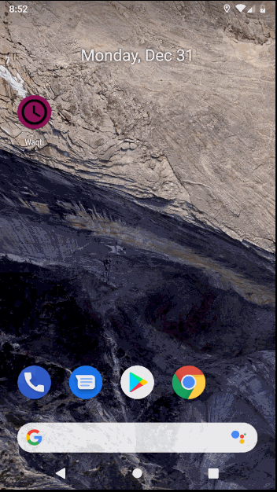

# Waqti


* [Overview](#overview)
* [Current Functionality](#current-functionality)
* [Implementation Details](#implementation-details)
    * [Open Source Libraries](#open-source-libraries)
* [License](#license)

README last updated on Fri-28-Jun-19



[Short Feature Demo Mon-31-Dec-18](https://www.youtube.com/watch?v=M1I4selR5lw)

## Overview

Waqti (My Time in Arabic) is an Android app for a Kanban board time management system 
similar to Trello.

Waqti was motivated by a frustration with using Trello as a daily time management system. Trello 
is excellent for many applications, particularly project management with teams, but lacks 
features when used as a personal time management system. Waqti is intended to fill the gaps where Trello 
fails in this regard.

## Current Functionality

Currently the application is fully usable with minimal functionality.

Currently (Fri-28-Jun-19) the user can: 

* Create new boards, lists and tasks
* Rename, reorder and delete boards, lists and tasks
* Rename the container of all the boards and reorder the boards in it
* Change 3 settings related to viewing the board:
    * The task list width
    * The task card text size
    * The board scroll snap mode

## Implementation Details

Waqti uses a Single-Activity design, so all Android UI controllers are fragments within 
[MainActivity](https://github.com/basshelal/Waqti/blob/master/app/src/main/java/uk/whitecrescent/waqti/frontend/MainActivity.kt).

The main gem of this application is the custom made BoardView. While there exist many libraries 
that solve this problem, none of them were satisfactory enough to meet the needs of the 
application, so a custom solution was built. This can be found in 
[BoardView](https://github.com/basshelal/Waqti/blob/master/app/src/main/java/uk/whitecrescent/waqti/frontend/customview/recyclerviews/BoardView.kt)
and [TaskListView](https://github.com/basshelal/Waqti/blob/master/app/src/main/java/uk/whitecrescent/waqti/frontend/customview/recyclerviews/TaskListView.kt)
which both make up the custom BoardView solution.

### Open Source Libraries

This project makes use of multiple open source libraries including but not limited to:

* [Kotlin](https://github.com/JetBrains/kotlin)
* [ObjectBox](https://github.com/objectbox/objectbox-java)
* [RxJava](https://github.com/ReactiveX/RxJava) 
* [RxAndroid](https://github.com/ReactiveX/RxAndroid) 
* [JUnit5](https://github.com/junit-team/junit5) 
* [ThreeTenABP](https://github.com/JakeWharton/ThreeTenABP) 
* [Gson](https://github.com/google/gson) 
* [Material Components for Android](https://github.com/material-components/material-components-android)
* [ShapeOfView](https://github.com/florent37/ShapeOfView)
* [Anko](https://github.com/Kotlin/anko)
* [LeakCanary](https://github.com/square/leakcanary) 
* [Android Unsplash](https://github.com/KeenenCharles/AndroidUnplash) 
* [CircularImageView](https://github.com/lopspower/CircularImageView) 
* [Retrofit](https://github.com/square/retrofit) 
* [Glide](https://github.com/bumptech/glide) 
* [Android About Page](https://github.com/medyo/android-about-page) 
* [Material Dialogs](https://github.com/afollestad/material-dialogs) 
* [Flashbar](https://github.com/aritraroy/Flashbar) 
* [Spotlight](https://github.com/TakuSemba/Spotlight) 

## License

```
MIT License

Copyright (c) 2019 Bassam Helal

Permission is hereby granted, free of charge, to any person obtaining a copy
of this software and associated documentation files (the "Software"), to deal
in the Software without restriction, including without limitation the rights
to use, copy, modify, merge, publish, distribute, sublicense, and/or sell
copies of the Software, and to permit persons to whom the Software is
furnished to do so, subject to the following conditions:

The above copyright notice and this permission notice shall be included in all
copies or substantial portions of the Software.

THE SOFTWARE IS PROVIDED "AS IS", WITHOUT WARRANTY OF ANY KIND, EXPRESS OR
IMPLIED, INCLUDING BUT NOT LIMITED TO THE WARRANTIES OF MERCHANTABILITY,
FITNESS FOR A PARTICULAR PURPOSE AND NONINFRINGEMENT. IN NO EVENT SHALL THE
AUTHORS OR COPYRIGHT HOLDERS BE LIABLE FOR ANY CLAIM, DAMAGES OR OTHER
LIABILITY, WHETHER IN AN ACTION OF CONTRACT, TORT OR OTHERWISE, ARISING FROM,
OUT OF OR IN CONNECTION WITH THE SOFTWARE OR THE USE OR OTHER DEALINGS IN THE
SOFTWARE.
```